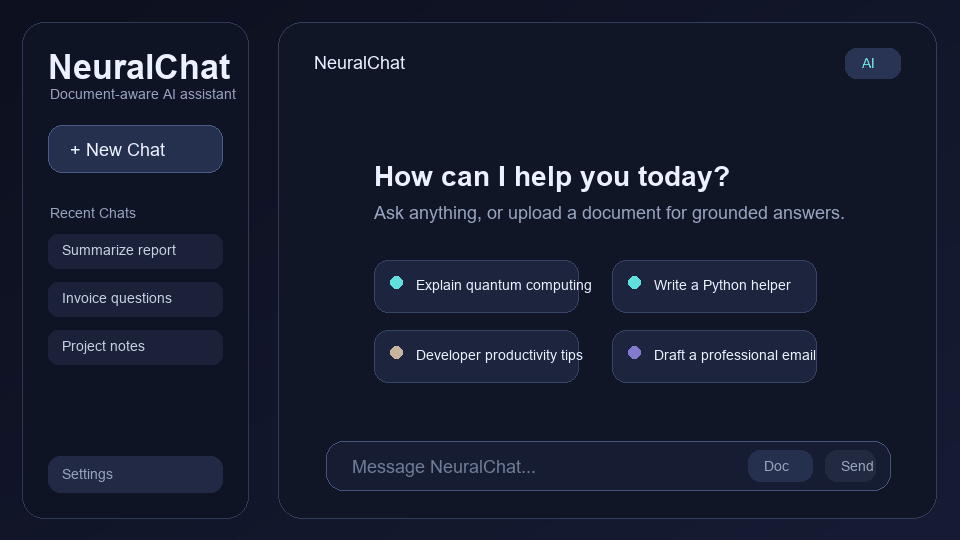

# NeuralChat — Intelligent RAG AI Assistant

NeuralChat is a premium, document-aware AI chatbot application. It combines a high-performance Python backend with a stunning glassmorphism-inspired web interface, now upgraded with a powerful **RAG (Retrieval-Augmented Generation)** pipeline.

## ✨ Key Features

- **📄 Document Intelligence (RAG)**: Upload PDF or TXT files to give the AI context. Ask questions directly about your documents.
- **🚀 Google Gemini 2.5 Integration**: Powered by the latest `gemini-2.5-flash` model for blazing-fast, intelligent responses.
- **💎 Premium Glassmorphic UI**: A state-of-the-art dark interface with Backdrop Filter effects, smooth micro-animations, and a responsive layout.
- **📂 Persistent Chat History**:
  - **Standard Chat**: Managed via JSON for lightweight session tracking.
  - **RAG Chat**: Powered by a **SQLite database** for robust, persistent document-based conversations.
- **📍 Source Referencing**: Every RAG response includes collapsible "Source Pills" showing exactly which part of the document was used.
- **🌓 Dual Mode**: Toggle between standard AI chat and "Doc Mode" with a single click.
- **🗄️ Vector Storage**: Uses **ChromaDB** for local high-speed vector embeddings and document retrieval.

## 🚀 Installation & Setup

### 1. Prerequisites
Ensure you have Python 3.9+ installed.

### 2. Setup Virtual Environment
```powershell
python -m venv .venv
.\.venv\Scripts\activate
```

### 3. Install Dependencies
```powershell
pip install -r requirements.txt
```

### 4. Configure Environment
Create a `.env` file in the root directory:
```env
GEMINI_API_KEY=your_google_gemini_key_here
GEMINI_MODEL=gemini-2.5-flash
```
*Get your API key for free from the [Google AI Studio](https://aistudio.google.com/).*

## 🛠️ How to Run

### Start the Backend Server
This launches the Flask API and serves the glassmorphic frontend at `http://localhost:5000`.
```powershell
python api.py
```

## 🧠 System Architecture

1. **Ingestion**: When a PDF is uploaded, `pdfplumber` extracts text, which is then chunked and stored in **ChromaDB**.
2. **Retrieval**: When you ask a question in "Doc Mode", the system retrieves the most relevant text chunks from the vector store.
3. **Augmentation**: The retrieved context is injected into the Gemini 2.5 prompt.
4. **Generation**: Gemini generates a response, which is then streamed word-by-word to the UI.

## Interface Preview


---
*NeuralChat — Building the future of document-aware AI.*
